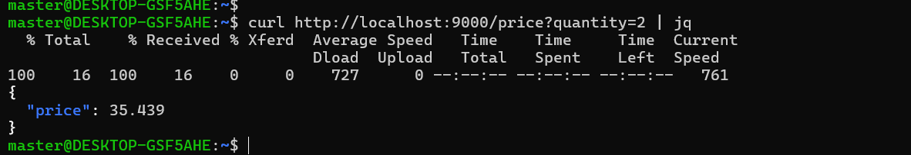

# Description

This is a web service with endpoint to monitor and processes real-time data from VALR exchange's USDT/ZAR orderbook using WebSockets and provides an API to retrieve prices.


# Set up instructions
This would create a virtual enviroment and install the web service

## on windows
```shell
install poetry https://python-poetry.org/docs/
check version using poetry --version
```
if unsuccessful 
Find Poetry's path: Usually it's C:\Users\<YourUsername>\AppData\Roaming\pypoetry\venv\Scripts.

Add Poetry to PATH:

Open System Properties (Win+Pause > "Advanced system settings")
Go to "Environment Variables"
In "System Variables", find "Path" and click "Edit"
```shell
Append ;C:\Users\<YourUsername>\AppData\Roaming\pypoetry\venv\Scripts to the Variable Value
```
Click OK to close dialogs
Replace <YourUsername> with your Windows username.

## locally
```shell
poetry install 
```
## Configuration


Note for Windows would be a different command (copy)


# Using instructions

Usage of [gunicorn](https://gunicorn.org/) in conjunction with [uvicorn](https://www.uvicorn.org/) to manage a server that can cope with multiple requests without blocking 

## Running the service locally

1. Activate the environment where the app has been installed
```shell
poetry shell 
```

## for windows run
navigate to valr-project home dir and run :
```shell
uvicorn orderbook-service.api.service:app --host 0.0.0.0 --port 9000
```
## swagger documentation
```shell
http://localhost:9000/docs#/
```

2. Run the web service
```shell
gunicorn orderbook-service.api.service:app --workers 2 --worker-class uvicorn.workers.UvicornWorker --bind 0.0.0.0:9000
```


## Running the service in a docker container
first navigate to the valr-project\orderbook-service directory 

building the container
```shell
docker build -t orderbook-service .

```
running the container
```shell
docker run -d -p 9000:9000 orderbook-service

```

# API documentation


#### Examples

Returns the price of the quantity

```shell

curl http://localhost:9000/price?quantity=2

```
 


